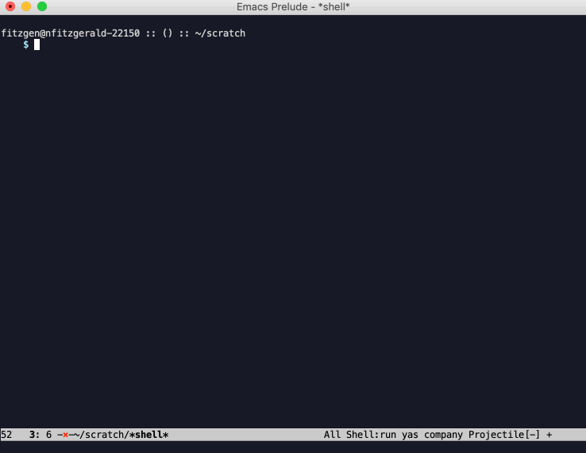

<div align="center">

  <h1><code>fart</code> &mdash; fitzgen's art</h1>

  <strong>A framework to create SVG-based generative art for pen plotters</strong>

  <p>
    <a href="https://docs.rs/fart/"></a>
    <a href="https://crates.io/crates/fart"></a>
    <a href="https://crates.io/crates/fart"></a>
    <a href="https://travis-ci.com/fitzgen/fart"></a>
  </p>

</div>

<!-- START doctoc generated TOC please keep comment here to allow auto update -->
<!-- DON'T EDIT THIS SECTION, INSTEAD RE-RUN doctoc TO UPDATE -->


- [About](#about)
- [Install](#install)
- [Quick Start](#quick-start)
- [CLI](#cli)
  - [`fart new <name>`](#fart-new-name)
  - [`fart run`](#fart-run)
  - [`fart watch`](#fart-watch)
  - [`fart serve`](#fart-serve)
- [Library](#library)
  - [Modules](#modules)
    - [`fart::prelude`](#fartprelude)
    - [`fart::canvas`](#fartcanvas)
    - [`fart::shape`](#fartshape)
    - [`fart::path`](#fartpath)
    - [`fart::aabb`](#fartaabb)
    - [`fart::geom`](#fartgeom)
  - [Re-exports](#re-exports)

<!-- END doctoc generated TOC please keep comment here to allow auto update -->

## About

`fart` is my personal tooling and framework for SVG-based generative
art. Originally inspired by [Benjamin Kovach's excellent write up on
infrastructure and tooling for generative
art,](https://www.kovach.me/posts/2018-10-13-infrastructure-of-art.html) but has
been evolving in its own direction since then.

## Install

```
cargo install fart
```

## Quick Start



Generate a new `fart` project:

```
$ fart new my-cool-project
```

Run `fart watch` to automatically build your project and generate an SVG on each
change.

```
$ cd my-cool-project/
$ fart watch
```

Hack on your project! Keep refreshing `my-cool-project/images/latest.svg` in
your browser or preferred SVG viewer to see what your results look like.

## CLI

For a full listing of CLI commands and flags, run `fart help [subcommand]`.

### `fart new <name>`

Create a new `fart` project named `<name>`.

### `fart run`

Compile and run a a `fart` project, producing a new, time-stamped SVG render
that is automatically committed for you.

### `fart watch`

Watch a `fart` project, automatically build and run it on each change. Saves and
commits time-stamped SVGs for you, so you can see the evolution of your project.

### `fart serve`

Serve a project and its rendered SVGs on a local HTTP server. Automatically
watches the project for changes and re-builds and re-runs it on each change,
similar to `fart watch`.

Eventually, will do hot reloading on the Web client, display logs, and have
user-configurable parameters. Stay tuned!

## Library

Contains utilities for generating SVGs, building scenes, and working with
numbers and RNGs.

[**Read the API docs!**](https://docs.rs/fart)

### Modules

#### `fart::prelude`

Common traits and functions that are used most of the time.

Intended for most projects to glob import the whole thing:

```rust
use fart::prelude::*;
```

#### `fart::canvas`

A canvas is a collection of drawn paths, which can be rendered into an SVG.

#### `fart::path`

Paths that get drawn in the SVG. Paths are made up of a series of line commands,
and have a an associated color.

#### `fart::process`

Helpers for making images from processing-style,
update->draw->update->draw->... loops.

#### `fart::aabb`

2D axis-aligned bounding boxes (AABBs) and AABB trees. Useful for
fast-but-imprecise detection of collision/intersection/containment between
things.

#### `fart::geom`

A hodge-podge assortment of 2D computational geometry algorithms built on top of
`euclid`.

### Re-exports

`fart` has many re-exports of other crates, to let you hit the ground running!

* `fart::euclid`: Re-export of the `euclid` crate.

* `fart::failure`: Re-export of the `failure` crate.

* `fart::noise`: Re-export of the `noise` crate.

* `fart::num_traits`: Re-export of the `num-traits` crate.

* `fart::rand`: Re-export of the `rand` crate.
